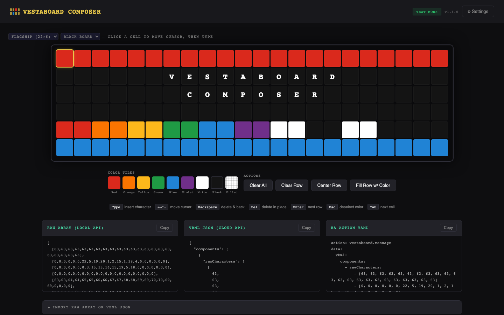

# Vestaboard Composer

A frontend plugin for Home Assistant that provides a visual board composer for [Vestaboard](https://www.vestaboard.com/) displays.

Requires the [ha-vestaboard](https://github.com/natekspencer/ha-vestaboard) integration.

[](https://github.com/sbeitzel/ha-vestaboard-composer/actions/workflows/validate.yml)
[](https://github.com/sbeitzel/ha-vestaboard-composer/actions/workflows/ci.yml)



---

## Features

- Supports **Flagship** (22×6) and **Note** (15×3) board models — switch with the dropdown in the top-left
- Supports both black and white models
- Visual grid editor with keyboard navigation
- Color tile palette (verified color codes)
- Per-row actions: Clear, Center text, Fill with color
- Three output formats for use in automations:
  - **Raw Array** — local API format
  - **VBML JSON** — cloud API format
  - **HA Action YAML** — paste directly into Developer Tools → Actions
- **Send Now** — select a device and send instantly, with optional duration (reverts to previous message when it expires)
- **Load Current** — read the message currently displayed on a device and load it into the editor
- **Import** — paste a raw array or VBML JSON directly into the editor

---

## Installation via HACS

[](https://my.home-assistant.io/redirect/hacs_repository/?owner=sbeitzel&repository=ha-vestaboard-composer&category=Frontend)

1. Click the button above, or in HACS go to **Frontend** → **+ Explore & Download Repositories** and search for **Vestaboard Composer**
2. Download the repository
3. Add the panel to your `configuration.yaml`:

```yaml
panel_custom:
  - name: vestaboard-composer
    sidebar_title: Vestaboard
    sidebar_icon: mdi:bulletin-board
    url_path: vestaboard
    module_url: /hacsfiles/ha-vestaboard-composer/ha-vestaboard-composer.js
```

4. Restart Home Assistant

The **Vestaboard** entry will appear in your sidebar.

---

## Manual Installation

1. Copy `ha-vestaboard-composer.js` to `<config>/www/vestaboard/ha-vestaboard-composer.js`
2. Add to `configuration.yaml`:

```yaml
panel_custom:
  - name: vestaboard-composer
    sidebar_title: Vestaboard
    sidebar_icon: mdi:bulletin-board
    url_path: vestaboard
    module_url: /local/vestaboard/ha-vestaboard-composer.js
```

3. Restart Home Assistant

---

## Usage

### Board Editor
- **Click** any cell to move the cursor there
- **Type** to insert characters (letters, numbers, punctuation)
- **Arrow keys** move the cursor; **Tab** advances one cell
- **Enter** jumps to the start of the next row
- **Backspace** clears a cell and moves back; **Delete** clears in place
- **Home / End** jump to the start or end of the current row

### Color Tiles
- Click a color swatch to enter **Color Mode** — the current cell gets that color and the cursor advances
- Click the same swatch again (or press **Esc**) to return to Text Mode
- In Color Mode, clicking any cell applies the selected color

### Row Actions
| Button | Action |
|---|---|
| Clear All | Blank the entire board |
| Clear Row | Blank the cursor's row |
| Center Row | Center the text content of the cursor's row |
| Fill Row w/ Color | Fill the entire cursor row with the selected color (or Red if none selected) |

### Loading the Current Message

Select a device from the dropdown in the **Send to Vestaboard** section, then click **Load Current**. The composer reads the message currently displayed on the board — including its model and color — and loads it into the editor, ready to tweak and re-send.

The board model and color dropdowns update automatically to match the device. This requires the [ha-vestaboard](https://github.com/natekspencer/ha-vestaboard) integration to have successfully polled the board at least once (it polls every 15 seconds by default).

### Importing from Clipboard

Expand the **Import Raw Array or VBML JSON** section and paste one of:

- A **raw array** — a JSON array of arrays, e.g. `[[0,63,0,...],[...]]`
- A **VBML JSON** object with a `components[0].rawCharacters` field

Click **Import**. The board model is inferred from the array dimensions (6×22 → Flagship, 3×15 → Note) and the grid updates accordingly. The board color is not inferred — set it manually with the color dropdown if needed. An inline error is shown if the JSON is invalid or the dimensions don't match a known board model.

### Sending a Message
Expand the **Send to Vestaboard** section:
- Select a device from the dropdown (populated automatically from your HA device registry)
- Optionally enter a **duration** in seconds (10–43200); leaving it blank makes the message permanent until replaced
- Click **Send Now**

### Output Boxes
The three output boxes update live and can be copied to clipboard:
- **Raw Array** — `[[...], ...]` rows×columns array for the local API
- **VBML JSON** — single-component VBML object for the cloud API
- **HA Action YAML** — ready to paste into Developer Tools → Actions or an automation

---

## Vestaboard Character Code Reference

| Code | Character |
|---|---|
| 0 | Blank |
| 1–26 | A–Z |
| 27–36 | 1–9, 0 |
| 37 | ! |
| 38 | @ |
| 39 | # |
| 40 | $ |
| 41 | ( |
| 42 | ) |
| 44 | - |
| 46 | + |
| 47 | & |
| 48 | = |
| 49 | ; |
| 50 | : |
| 52 | ' |
| 53 | " |
| 54 | % |
| 55 | , |
| 56 | . |
| 59 | / |
| 60 | ? |
| 62 | ° |
| 63 | Red |
| 64 | Orange |
| 65 | Yellow |
| 66 | Green |
| 67 | Blue |
| 68 | Violet |
| 69 | White |
| 70 | Black |
| 71 | Filled |
